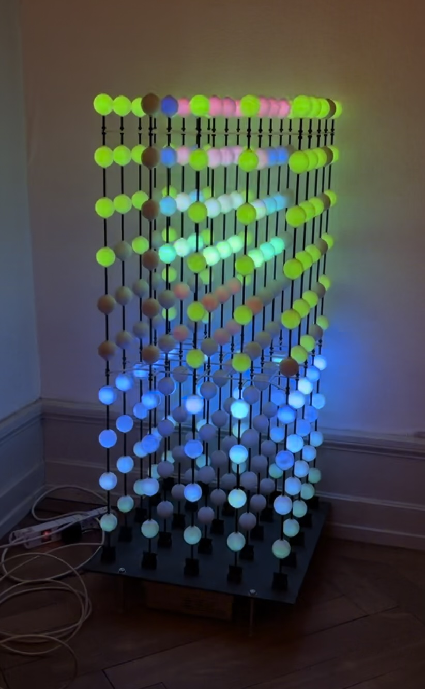

# Nova voxel display control software

Rust-based procedural content generation for the Nova voxel display, with a desktop simulator and a React control interface.

Four content families explore the low-resolution volume: **Field**, **Layers**, **Threads**, and **Cloud**. Independent **Brightness** controls output level; **Tone**, **Heat**, **Flow**, and **Form** shape the content. Audio synthesis and its independent Volume control are planned for a later milestone.

This README is the canonical project guidance for both human contributors and coding agents. Follow the control semantics and design constraints below when changing the project.

## Getting started

- [Raspberry Pi setup](doc/raspberry_pi_setup.md)
- [Development setup, operation, and troubleshooting](doc/nova_control.md)
- [Hardware protocol reference](doc/nova_protocol.md)

## The display

NOVA is a modular RGB voxel LED display driven at 25 Hz (40 ms per displayed frame). The current architecture leaves approximately 20 ms per frame for rendering.

- Each module has a 50 x 50 cm base and is 100 cm high.
- A module contains 5 x 5 x 10 voxels: 250 LEDs.
- Voxels are matte, white, ping-pong-like plastic spheres that diffuse the light.
- Output can be very bright in dark environments.

One module displaying random content:



## Artistic controls

Use one universal control set for all content modules. Keep this order consistent in structs, API payloads, and UI state. Every value ranges from 0 to 1.

| Control                       | Meaning and implementation contract                                                                                                              |
| ----------------------------- | ------------------------------------------------------------------------------------------------------------------------------------------------ |
| **Brightness** (`brightness`) | Global visual output level. Apply once in the renderer, after content generation; never feed the scaled output back into content.                |
| **Tone** (`tone`)             | Dominant color steer, mapping to 0-360 degrees of hue. Steer an authored OKLCH palette, not independent random voxel colors.                     |
| **Heat** (`heat`)             | Quickly reaches rich color by 0.5; the upper range smoothly adds palette contrast and accents. Does not change occupancy, motion speed, or Form. |
| **Flow** (`flow`)             | Animation rate. Zero freezes the current composition; changing the value must not jump the animation phase.                                      |
| **Form** (`form`)             | Simple to complex. Add overlap and positional variation within a family; never turn planes into lines or introduce sub-voxel noise.              |

### Design principles

- Use the same controls for every module, with creative interpretations that preserve their shared meaning.
- `RenderState` only carries values; it must not remap their semantics.
- Keep the control surface simple. Add presets later if needed.
- Keep dependencies minimal in both the web app and Rust server; prefer existing capabilities for small changes.
- Keep Form for this milestone; its long-term inclusion remains open.
- Future audio shares Tone, Heat, Flow, and Form, with an independent Volume output control. Do not expose Volume before synthesis exists.

## Content families

| Family      | Spatial character                                          | Form behavior                                                |
| ----------- | ---------------------------------------------------------- | ------------------------------------------------------------ |
| **Field**   | Broad, coherent color washes with soft edges.              | Sparse lit regions to a fully revealed gradient.             |
| **Layers**  | Horizontal slices at different heights, fading in and out. | Sparse soft handoffs to denser overlap and varied positions. |
| **Threads** | Full-height vertical columns, fading in and out.           | Sparse soft handoffs to denser overlap and varied positions. |
| **Cloud**   | A compact moving light pool, opening into organic clouds.  | Sparse pool to broad coherent organic noise.                 |

Preserve readable structures at 5 x 5 x 10. Favor broad regions and deliberate darkness, and sample spatial patterns in voxel units to retain physical scale across modules.

Field's Form controls coverage over a fixed-scale gradient. At zero, a broad lit region has a full-intensity core, soft edges, and unlit surroundings; increasing Form expands neighboring washes until the entire gradient is revealed at one. The coverage mask drifts back and forth within the display bounds so a full-strength core remains visible, including on a single module. Form changes neither the underlying colors nor drift speed. Coverage remains visible at low Heat, including zero; only the fully covered, zero-Heat endpoint is uniform and static.

Layers and Threads separate cycling from fades. Flow controls new events through the shared animation speed: `FADE_EVENTS_PER_PHASE_UNIT = 0.18` gives about 1.8 new events per second at maximum Flow with the current global multiplier. Each structure fades in and out over `FADE_SECONDS = 1.875` active seconds per direction, independent of nonzero Flow. Zero Flow freezes both clocks; changing Flow never retimes an existing fade.

At Form zero, a structure holds until its replacement starts and it has reached full intensity, then fades out softly. Higher Form adds hold time in event-cycle units after both conditions are met and varies positions, retaining more events even at maximum Flow. Fast cycling naturally overlaps several slow fading tails, even at Form zero; tails are never truncated to impose a strict object count. Overlaps use intensity-weighted color blending with total intensity capped at one, preserving monochromatic colors without channel clipping. Sparse means fewer held structures, not reduced peak intensity. Brightness remains the final output multiplier. Both timing constants live in `server/src/content.rs`.

Cloud starts with a compact, full-strength pool at Form zero and blends into broad organic coverage at one. Heat up to 0.5 stays on the selected Tone while building saturation; above 0.5, brighter regions progressively reach supporting hues and contrasting accents. Heat does not change the coverage or intensity envelope.

## Color and performance

- Prefer OKLCH for palette operations and previews to keep saturation and lightness perceptually even across hues.
- All families share one gamut-relative palette response. Reduce chroma using unclamped RGB conversion to preserve hue and lightness; do not independently clip color channels as a gamut-mapping strategy.
- All families stay monochromatic through Heat 0.5; palette contrast begins above that shared threshold.
- The Tone preview chip uses CSS `oklch(L C Hdeg)` and the same fast Heat curve. It approximates the dominant color, not accents or output brightness; browser gamut mapping differs from the renderer.
- Aim for no more than 20 ms render time per frame on a Raspberry Pi 4 (50 Hz loop). Keep turbulence and noise octaves in check.

## Control API

- Read state: `GET /api/get-state` returns `brightness`, `tone`, `heat`, `flow`, and `form`, plus other settings.
- Update a control: `GET /api/{brightness|tone|heat|flow|form}?value=<0..1>` updates and persists its value.
- Legacy `glow` settings and the setter endpoint remain accepted.
- Versioned content settings migrate the old six-effect indices to the four new families and enable all four on first upgrade.

## Development checks

From the repository root:

```sh
cargo test --manifest-path server/Cargo.toml
npm --prefix webapp run build
cargo build --manifest-path server/Cargo.toml
```

Build the web app before the server so the embedded UI matches the API. See the [control server documentation](doc/nova_control.md) for simulator use, content extensions, and visual diagnostics. Automated tests and simulator previews do not replace evaluation on the physical display or Raspberry Pi profiling.
