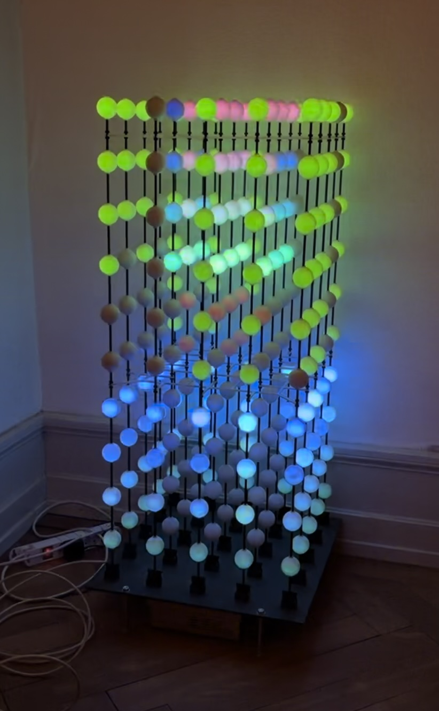

# Nova voxel display control software

Rust-based procedural content generation for the Nova voxel display, with a desktop simulator and a React control interface.

One content module, **Flux**, explores the low-resolution volume with a single noise primitive. Independent **Brightness** and **Volume** control visual and audio output; **Palette**, **Heat**, **Flow**, and **Form** shape both, and **Void** shapes the visuals. A restrained three-voice synthesizer adds early-computer-inspired tones and occasional rapid chord arpeggios. Audio starts muted on new installations.

This README is the canonical project guidance for both human contributors and coding agents. Follow the control semantics and design constraints below when changing the project.

## Getting started

- [Raspberry Pi setup](doc/raspberry_pi_setup.md)
- [Development setup, operation, and troubleshooting](doc/nova_control.md)
- [Hardware protocol reference](doc/nova_protocol.md)

`ENABLE_SIMULATOR` and `ENABLE_AUDIO` in `server/src/main.rs` both default to `true`. Set `ENABLE_SIMULATOR` to `false` for hardware display output. Set `ENABLE_AUDIO` to `false` to skip audio service startup and hide Volume in the web app; saved Volume is retained. These are build-time switches, not persisted settings, and disabling audio does not remove its build dependencies.

## The display

NOVA is a modular RGB voxel LED display driven at 25 Hz (40 ms per displayed frame). The current architecture leaves approximately 20 ms per frame for rendering.

- Each module has a 50 x 50 cm base and is 100 cm high.
- A module contains 5 x 5 x 10 voxels: 250 LEDs.
- Voxels are matte, white, ping-pong-like plastic spheres that diffuse the light.
- Output can be very bright in dark environments.

One module displaying random content:



## Artistic controls

Use one universal control set for all content modules. Keep this order consistent in structs, API payloads, and UI state. Every value ranges from 0 to 1. New installations and Restore defaults start every control at 0.5, except Volume at 0.

| Control                       | Meaning and implementation contract                                                                                                              |
| ----------------------------- | ------------------------------------------------------------------------------------------------------------------------------------------------ |
| **Brightness** (`brightness`) | Global visual output level. Apply once in the renderer, after content generation; never feed the scaled output back into content.                |
| **Volume** (`volume`)         | Independent audio output level, after the complete synth/effects mix. Zero mutes, with a short click-preventing ramp; musical time continues.    |
| **Palette** (`palette`)       | One of the curated Pantone palettes, by name. The web app steps through them with ‹ › buttons, wrapping around at both ends.                    |
| **Heat** (`heat`)             | Gray at 0, the palette as published at 0.5, up to twice its saturation at 1, preserving hue. Does not change occupancy, motion speed, or Form.  |
| **Flow** (`flow`)             | Evolution rate. Zero freezes the visual composition but retains slow audio evolution; changing the value must not jump either timeline.          |
| **Form** (`form`)             | Structure, from horizontal layers through columns, blobs and patches to per-voxel grain. Also sets how many palette colors show at once.         |
| **Void** (`void`)             | Fraction of the volume left dark. Lit voxels keep the same brightness at any value. Visual only.                                                |

### Design principles

- Use the same controls for every module, with creative interpretations that preserve their shared meaning.
- `RenderState` only carries values; it must not remap their semantics. The one exception is tides (below): the renderer moves the effective Heat, Flow, Form and Void slightly around the sliders before content renders. Sliders always show the user's setting.
- Keep the control surface simple. Add presets later if needed.
- The web app shows icons without text labels, so users discover the controls by exploring. `SHOW_LABELS` in `webapp/src/ControlRow.tsx` turns labels on; screen readers always get them.
- Hide the content chooser when fewer than two modules are enabled. A sole enabled module is automatically selected.
- Keep dependencies minimal in both the web app and Rust server; prefer existing capabilities for small changes.
- Keep Form for this milestone; its long-term inclusion remains open.
- Audio shares Palette, Heat, Flow, and Form, with independent Volume. Keep Brightness out of synthesis and Volume out of visual rendering.

## Audio

The first sound palette is shared across all visual families, not triggered by individual voxels or visual events. CPAL drives an independent sample-rate stream on the server machine; browsers only control it. FunDSP supplies band-limited triangle/pulse oscillators, faint noise and a resonant Simper state-variable low-pass per voice. Rounded envelopes, subtle pulse-width movement, pitch gestures and a quiet filtered stereo echo keep the sound spacious. Resonance is bounded below self-oscillation; fixed mix headroom, DC removal and soft peak protection precede the smoothed Volume gain. Volume uses a squared gain curve for finer low-level adjustment.

- **Palette**: until the sound is reworked, the selected palette's position in the list stands in for the former Tone control. It chooses a circular harmonic palette with pentatonic intervals. New pitch centres wait for existing voices to finish; sounding notes are not abruptly retuned.
- **Heat** adds pulse harmonics, filter openness and modest resonance, not more events or higher master gain. Perceived loudness may still vary with timbre.
- **Flow** changes note-event pace with a nonzero minimum. At zero, notes still appear and filters evolve slowly. Existing envelopes are timed in seconds and are never retimed by Flow changes.
- **Form** adds overlap, motif activity and occasional rapid arpeggios within a single voice. At most three voices and one arpeggiated voice sound at once; busy voices finish rather than being cut off. Arpeggio steps are 25-60 ms, independent of Flow, under one continuous envelope.

The audio callback must not lock application state, allocate, log or access files. Controls are published by the audio service and smoothed inside the synth. Output uses the OS default device and its sample rate, with mono downmix when needed. Missing/disconnected devices are reported separately from display status and retried without stopping visuals. A recovered stream fades in from silence. First startup and restored defaults use Volume zero; saved nonzero Volume resumes on subsequent launches. Begin listening with low speaker/system volume.

`server/src/audio.rs` is the module entry point; sound constants and device-independent tests live in `server/src/audio/synth.rs`, and native output lives in `server/src/audio/output.rs`. CPAL 0.18.2 and FunDSP 0.23.0 provide output and DSP respectively; the resolved audio dependencies require Rust 1.89 or newer, and CoreAudio output requires macOS 14.2 or newer. FunDSP's optional file-decoding and FFT features remain disabled. Numerical tests do not establish sound quality: tune at installation listening levels and profile with visuals active on the actual Raspberry Pi.

## Content

**Flux** is the only content module. Its complete specification is the pseudocode at the top of `server/src/content/flux.rs`; keep it in sync with the code.

- One 4D simplex noise primitive covers the whole Form range. Form blends five fields that differ only in their per-axis frequencies: layers (Form 0), columns (0.25), blobs (0.5), patches (0.75), and grain (1). Frequencies are fixed, so moving Form never zooms the pattern; blends are normalized to constant contrast.
- Brightness is computed by rank, so Void is exactly the fraction of dark voxels and lit voxels look the same at any Void.
- The structure rises slowly and sways with a slow tide that now and then reverses its direction.
- All motion follows the Flow-integrated phase. Nothing may change the coefficient of that phase, or the pattern jumps; variation over time goes through bounded terms.

Preserve readable structures at 5 x 5 x 10, and sample spatial patterns in voxel units so additional modules show more of the same field rather than a stretched one.

## Tides

Tides are slow, subtle variation brought in by the system rather than the user, defined in `server/src/tides.rs`. Each tide is a smooth, bounded swell of two sines with golden-ratio periods, so it never loops exactly and needs no state; sound can later compute identical values.

- Global tides, applied by the renderer to every content module: Heat (37 s, ±0.08), Flow (23 s, ±0.10), Form (53 s, ±0.06) and Void (29 s, ±0.08). The swing tapers to nothing at 0 and 1, so both extremes stay exact; in particular Flow 0 stays 0.
- Content modules can run their own tides on the same clock (`RenderState::tide_seconds`). Flux stretches its structures vertically, varies how many colors show at once, and swings which colors dominate.
- `FREEZE_WITH_FLOW` (on): the tide clock only advances while Flow is above 0, so Flow 0 keeps the display completely still. `TIDE_DEPTH` scales every tide; 0 switches them off.
- Tides must never change the coefficient of a time term, or patterns jump; they only move bounded values.

## Color and performance

- Palettes are curated Pantone sets in `server/src/content/palettes.rs`, compiled into the binary and listed by hue. Each has 1 to 6 colors (checked at compile time), and names must be unique. The file documents where each value comes from. `doc/palettes.svg` and `doc/palettes.png` show all palettes; regenerate the SVG with `cargo test --manifest-path server/Cargo.toml palettes_overview_svg -- --ignored`.
- A separate, slower noise picks palette positions. Neighbouring colors are mixed in Oklab: about two colors show at once for smooth structures and all colors for grain, slowly rotating through the palette.
- Heat preserves hue: it stops increasing saturation before any channel would clip.
- Pantone colors describe surfaces, so dark palette colors drive the LEDs at low power. Evaluate brightness on the physical display before compensating.
- Aim for no more than 20 ms render time per frame on a Raspberry Pi 4 (50 Hz loop). Keep turbulence and noise octaves in check.

## Control API

- Read state: `GET /api/get-state` returns `brightness`, `volume`, `palette`, `heat`, `flow`, `form`, and `void`, plus other settings. Content and palettes are referenced by name: `available-content` lists all content modules, `enabled-content` the enabled ones, `selected-content` the selected one, and `palettes` lists every palette with its colors (`name`, `code`, CSS `hex`) in display order.
- The read-only `audio-enabled` state field reflects `ENABLE_AUDIO`, independently of audio-device health. The web app hides Volume and audio errors when it is false.
- Update a control: `GET /api/{brightness|volume|heat|flow|form|void}?value=<0..1>` updates its value immediately. Select by name with `GET /api/palette?value=<name>`, `GET /api/selected-content?value=<name>`, and `GET /api/enabled-content?value=<name>,<name>`. Unknown names, and an empty enabled list, are rejected with 400 and change nothing; the web app then reloads its state. It also reloads when the page becomes visible again. The web server debounces saving settings by 500 ms; pending changes are not flushed on shutdown.
- `GET /api/reset` queues a one-shot hardware reset. The hardware loop consumes it and reopens the interface to run the existing module reset sequence; the request is not persisted and has no effect in simulator mode.
- `GET /api/get-status` reports independent `audio-ok` and `audio-message` fields alongside the existing display status.

## Development checks

From the repository root:

```sh
cargo test --manifest-path server/Cargo.toml
npm --prefix webapp run build
cargo build --manifest-path server/Cargo.toml
```

Build the web app before the server so the embedded UI matches the API. See the [control server documentation](doc/nova_control.md) for simulator use, content extensions, and visual diagnostics. Automated tests and simulator previews do not replace evaluation on the physical display or Raspberry Pi profiling.

The web toolchain supports Node.js 20 (20.19+), Node.js 22 (22.13+), or Node.js 24 and newer. TypeScript stays on 6.0.x because `typescript-eslint` 8.70 supports TypeScript below 6.1; upgrade it to TypeScript 7 only when the lint tooling supports that version. Run `npx --no-install eslint src` from `webapp` to check frontend lint rules.
