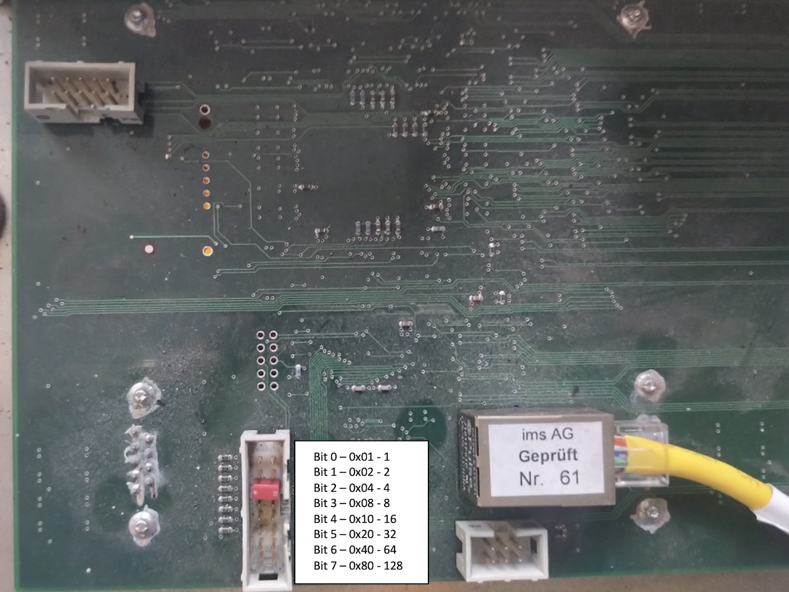

# Nova hardware protocol

The server talks to Nova modules over raw Ethernet. It sends a sync packet every 20 ms (50 Hz), alternating between "send pixels" and "shift pixels" (the previously sent pixels are shifted to the output), so the display frame rate is 25 Hz.

There are two packet types:

- **Sync packets** (`EtherType 0x0810`) for timing, status polls and replies, and shift commands
- **Data packets** (`EtherType 0x0800` + UDP port 3210) for RGB pixel chains, reset, and auto-ID

The implementation and all constants, including unused command codes, are in `server/src/nova.rs`.

## Module addressing

Each module's address is set by jumpers, one bit per jumper (bit 0 = 1 through bit 7 = 128). Its MAC and IP addresses are derived from it:

- MAC: `00:20:e3:10:00:<address>`
- IP: `192.168.1.<address>`

After giving your interface a static IP in `192.168.1.x`, you can ping modules directly.



## Sync packet (`EtherType 0x0810`)

```text
Offset  Len  Field           Value / Meaning
------- ---- --------------- -----------------------------------------------
0–5     6    DST MAC         Broadcast (FF:FF:FF:FF:FF:FF)
6–11    6    SRC MAC         Host interface MAC
12–13   2    EtherType       0x0810
14–15   2    Payload Length  Big-endian = 46 (0x002E)
16      1    Command         0x00 = SYNC, 0x04 = STATUS
17      1    Status flag     Reserved (0)
18      1    Sequence number 8-bit (wraps at 255)
19      1    Shift flag      1 = shift (no pixel UDP), 0 = send (pixel UDP follows)
20–45   26   Reserved        All zeros
```

- **Packet size**: 6 + 6 + 2 + 46 = 60 bytes
- **Usage**:
  - Every 20 ms: send SYNC with `send pixels` and `shift pixels` flag alternating
  - Every 5 s: send STATUS (`Command=0x04`) to poll modules
  - Modules reply with `Command=0x04`, DST MAC = host MAC

## Module reset and auto-ID

1. **Reset**: 4 rounds of UDP `UDP_CMD_RESET (0x00)`, 200 ms between rounds
2. **Auto-ID**: 1 round of UDP `UDP_CMD_AUTOID (0x70)`, 200 ms after

_All use the same UDP payload format ([data packet](#data-packet-ethertype-0x0800--udp-3210)) with `sequence=0`, `shift=false`._

## Data packet (`EtherType 0x0800` / UDP 3210)

### Ethernet + IP + UDP headers

```text
Offset  Len  Field           Value / Meaning
------- ---- --------------- -----------------------------
0–5     6    DST MAC         NOVA_MAC_PREFIX (00:20:E3:10:00) + module_address
6–11    6    SRC MAC         Host interface MAC
12–13   2    EtherType       0x0800 (IPv4)
14      1    IP ver + IHL    0x40|0x05 → v4, IHL=5
15      1    DSCP/ECN        0x00
16–17   2    Total Length    20+8+payload (≈1124)
18–19   2    ID              0x321c
20–21   2    Flags+Offset    0x4000 (DF)
22      1    TTL             128
23      1    Protocol        17 (UDP)
24–25   2    Checksum        header checksum
26–29   4    SRC IP          127.0.0.1
30–32   3    DST IP prefix   192.168.1
33      1    DST IP last     module_address
34–35   2    SRC UDP port    1234
36–37   2    DST UDP port    3210
38–39   2    UDP length      8 + payload (1100)
40–41   2    UDP checksum    0x0000
```

### Payload (25 chains × 44 B = 1100 B)

For each `chain` in 0…24:

```text
Byte  Field            Value / Meaning
----- ---------------- ---------------------------------
0     Marker           0xC0
1     Command          0x02=RGB, 0x00=RESET, 0x70=AUTOID
2     Sequence number  8-bit (wraps at 255)
3     Chain index      chain
4–43  Pixels           10×4 B packed RGB
```

- **Pixel packing**:
  ```text
  r10 = round(clamp(r,0,1)*1023)
  g10 = round(clamp(g,0,1)*1023)
  b10 = round(clamp(b,0,1)*1023)
  packed = (r10<<20)|(g10<<10)|b10
  ```
  — stored big-endian in 4 B
- **Flip**: if `flip=true`, index i → 9 − i

## Timing and framing

1. Wait for next 20 ms tick (sleep until ~5 ms before, then busy-wait)
2. Send sync packet with current `sequence_number` and `shift_pixels = (sync_mode == ShiftPixels)`
3. If `SendPixels`:
   - Render image
   - Send UDP RGB to each module (`UDP_CMD_RGB=0x02`) with `sequence+1`
   - `sync_mode = ShiftPixels`
4. Else (`ShiftPixels`):
   - `sequence_number = sequence_number.wrapping_add(1)`
   - Hardware shifts pixel buffer (no UDP)
   - `sync_mode = SendPixels`

Every 5 s: send STATUS to poll modules.

## Module status

On recv sync-packet (`Command=0x04`):

- Verify length ≥ `NOVA_PACKET_LEN`
- Verify IP src prefix == `NOVA_IP_PREFIX`
- Record `Instant::now()`
- Module is “ready” if seen within last 5 s
